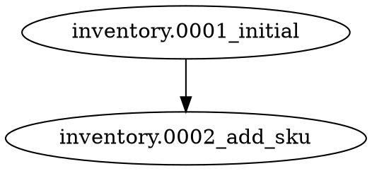

# Visualization

The toolkit now supports two graph visualization formats without requiring any hosted UI.

## Mermaid

Mermaid output is designed for:

1. Project documentation.
2. Pull request descriptions.
3. Team notes and migration reviews.

Generate it with:

```bash
python manage.py migration_inspect --format mermaid
python manage.py migration_inspect --offline --format mermaid
```

Example shape of the output:

```text
flowchart TD
    node_inventory_0001_initial["inventory.0001_initial"]
    node_inventory_0002_add_sku["inventory.0002_add_sku"]
    node_inventory_0001_initial --> node_inventory_0002_add_sku
```

Node styling is used to highlight:

1. Root migrations.
2. Leaf migrations.
3. Merge migrations.
4. Conflict heads in apps with multiple leaf nodes.

## Graphviz DOT

DOT output is designed for:

1. Graphviz rendering.
2. Architecture docs.
3. Automated graph pipelines.

Generate it with:

```bash
python manage.py migration_inspect --format dot
python manage.py migration_inspect --offline --format dot
```

Example shape of the output:



## Scope filtering

When you use `--app`, visualization stays focused on the visible app graph:

```bash
python manage.py migration_inspect --app analytics --format mermaid
```

That makes it easier to document or review one app at a time.
